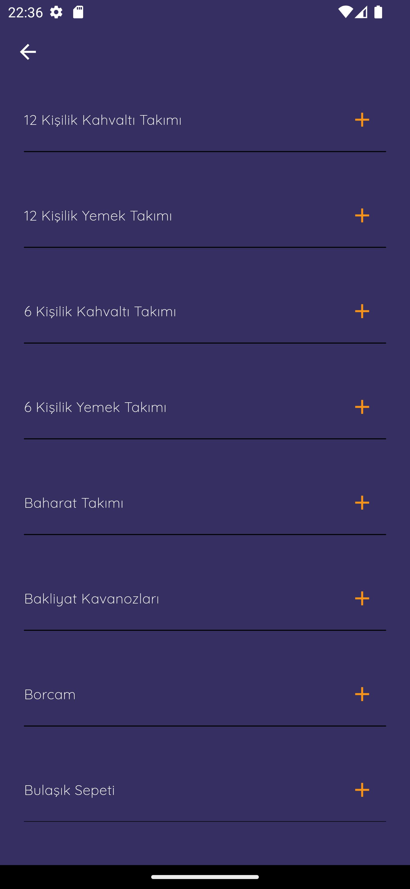

# Wedding Shopping Check

**Wedding Shopping Check**, evlilik hazırlıkları yapanlar için tasarlanmış bir Flutter uygulamasıdır. Bu uygulama sayesinde kullanıcılar, çeyiz listelerini takip edebilir, öğeleri yönetebilir ve eksiklerini kolayca kontrol edebilir.

## Özellikler

- Önceden hazırlanmış çeyiz listelerini görüntüleme
- Öğeleri ekleme, çıkarma ve düzenleme
- Kullanıcı verilerini yerel olarak saklama (SharedPreferences)
- Firebase entegrasyonu ile listeleri güncelleme

## Kurulum

### Gereksinimler

- Flutter SDK (>= 2.10)
- Bir Firebase projesi
- Android Studio veya Visual Studio Code

### Kurulum Adımları

1. **Projeyi Kopyala:**

   ```bash
   git clone https://github.com/kamurandogan/CeyizListem.git
   cd wedding_shopping_check

## Ekran Görüntüleri

### Ana Ekran


### Menu Ekranı


### Çeyiz Ekranı


### Ürün Ekranı


